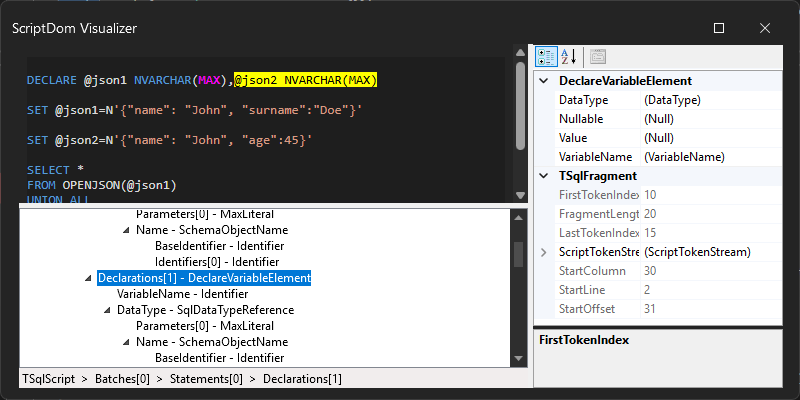
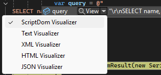

# ScriptDom Debug Visualizer

This is a Visual Studio extension that provides a debug visualizer for the [ScriptDom library](https://github.com/microsoft/SqlScriptDOM).
It allows you to visualize the structure of SQL scripts in a tree format, and correlate the nodes with the corresponding source code
to more easily find the relevant parts of the script.

## Installation

Install the extension from the [Visual Studio Marketplace](https://marketplace.visualstudio.com/items?itemName=MarkMpn.ScriptDomDebugVisualizer).

## Usage

In Visual Studio, when you hit a breakpoint in a debugging session, select the variable you want to inspect and click
"ScriptDom Visualizer" in the "View" menu.

This option will be available on variables of any of the following types:

* string
* TSqlScript
* TSqlBatch
* Any TSqlStatement-derived type

Once opened, the visualizer will show the SQL script at the top and the parsed ScriptDOM tree at the bottom. Hover over part of the
script to highlight the corresponding node in the tree, or hover over a node in the tree to highlight the corresponding part of the script.
Clicking on part of the script or a tree node will keep it selected while you move the mouse, click again to track the mouse again.

The details of the selected node are shown in the property grid on the right. Click on the "..." button next to any of the child
fragments to navigate to that child.

The path to the selected node is shown at the bottom of the visualizer, and you can click on any part of the path to select that node in the tree.